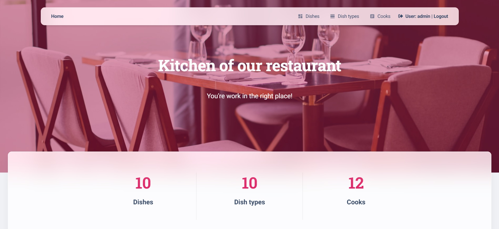
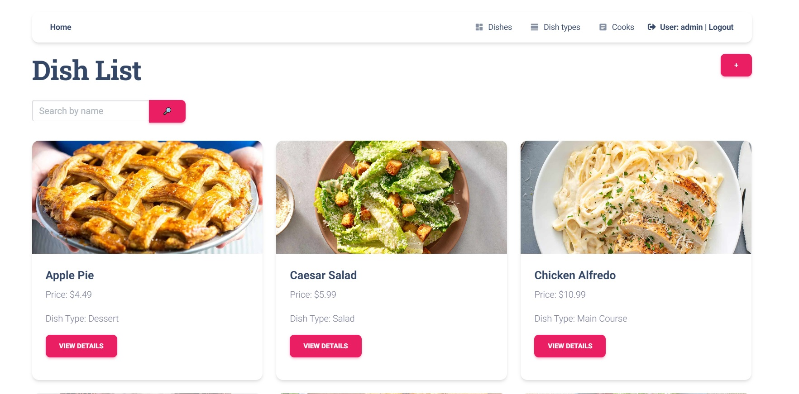

# Restaurant Kitchen project

Django project for managing restaurant with dish, dish types and cooks.

## Check it out!

[Explore the Restaurant Kitchen Project deployed on AWS!](http://3.71.28.201/)

## Installation

```shell
# Clone the repository
git clone https://github.com/b3v3kt0r/restaurant-kitchen-service

# Navigate into the project directory
cd restaurant-kitchen-service

# Create and activate a virtual environment
python3 -m venv venv

# For macOS/Linux:
source venv/bin/activate

# For Windows:
source venv\Scripts\activate

# Install the required dependencies
pip install -r requirements.txt

# Making migrations
python manage.py makemigrations
python manage.py migrate

# Set up .env file
You have create .env using .env.sample. like example

# Run the development server
python manage.py runserver
```

## Features

* User Authentication: Secure login and registration functionality for cooks/users.
* Dish Management: Create, update, and delete dishes directly from the web interface.
* Dish Type Management: Easily manage different types of dishes.
* Cook Management: Assign cooks to dishes and manage their profiles.
* Admin Panel: Powerful Django admin panel for advanced management.

## Usage
After installation, you can start the development server and access the application at http://127.0.0.1:8000/. From here, you can:

Register or log in as a cook.
Add, edit, or delete dishes and dish types.
Manage cooks and assign them to specific dishes.

username: admin
password: password

## Demo




## Contact
For contact me:
* Fullname: Stanislav Sudakov
* Email: stasiksudakov@gmail.com
* Telegram: @sssvvvff
